# FernanB&B

### Práctica Obligatoria 4 Fernando III

### Autor/es

Raúl Zúcar Aceituno

### Prerrequisitos  de instalación:

-Contar con conexión a internet

-Tener instalado jdk19

### Instalación:

Para instalar la aplicación simplemente hay que descargar la carpeta de gitHub o el enlace proporcionado y ejecutar el archivo FernanBnB.bat o FernanBnB (Si no se tiene activada la vista de extensiones de archivos)

## Funcionamiento de la aplicación

### 0.-Inicio de la aplicación

Al inicio de la aplicación, y dado que esta es una versión primigenia del desarrollo de esta, cuenta algunos datos de ejemplo que hemos introducido.

Al iniciar la aplicación nos preguntará si queremos insertar valores por defecto en la ejecución, esto creara:

-1 Usuario (usuario,pass)

-1 Propietario (propietario,pass)

-1 Administrador (admin,pass)

-1 Vivienda que pertenece al propietario anterior

-1 Reserva hecha por el usuario existente en la vivienda existente

*Entre paréntesis las credenciales para poder acceder a los perfiles y utilizar sus características*

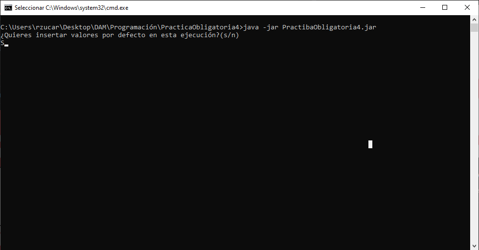

Saldrán indicaciones de que se han mandado correos y mensajes de telegram, lo cual significa que todo se ha hecho correctamtente.

Tras esto estaremos en el menú de la aplicación y podremos empezar a utilizarla.

### 1.-Menú de creación y  login de usuarios.

Este es el menú de inicio del programa.

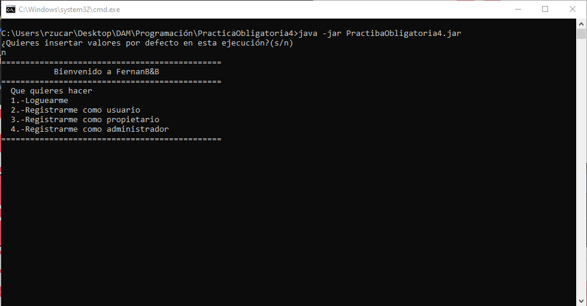

Donde seleccionaremos la acción que queremos realizar, en este caso empezaremos a explicar por los registros, para después pasar al login.

#### Registro de usuarios

Todos los usuarios se registran de la misma forma, excepto el administrador, ya que tiene que insertar una contraseña, la contraseña es "f3m".

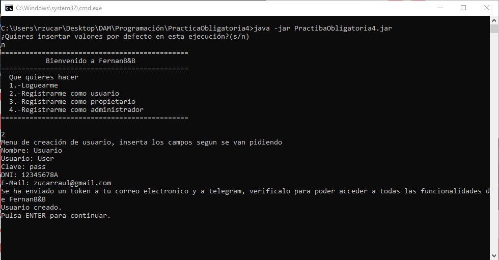

Rellenamos los campos que nos pide, se hace una comprobación de que tanto el DNI como el correo son válidos, y se manda el correo de verificación al gmail del usuario.

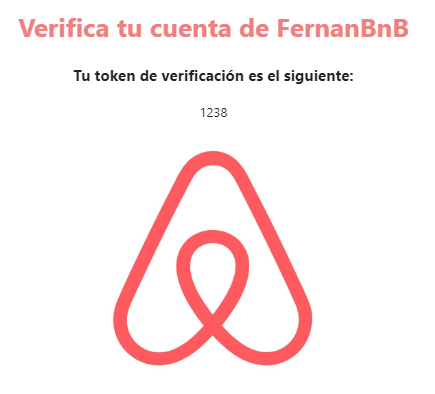

Esta operación tardará un poco y después ya podremos loguearnos con nuestros usuarios.

#### Login

El menú de login te pedirá usuario y contraseña para acceder al sistema y entraras como el tipo de usuario que seas.

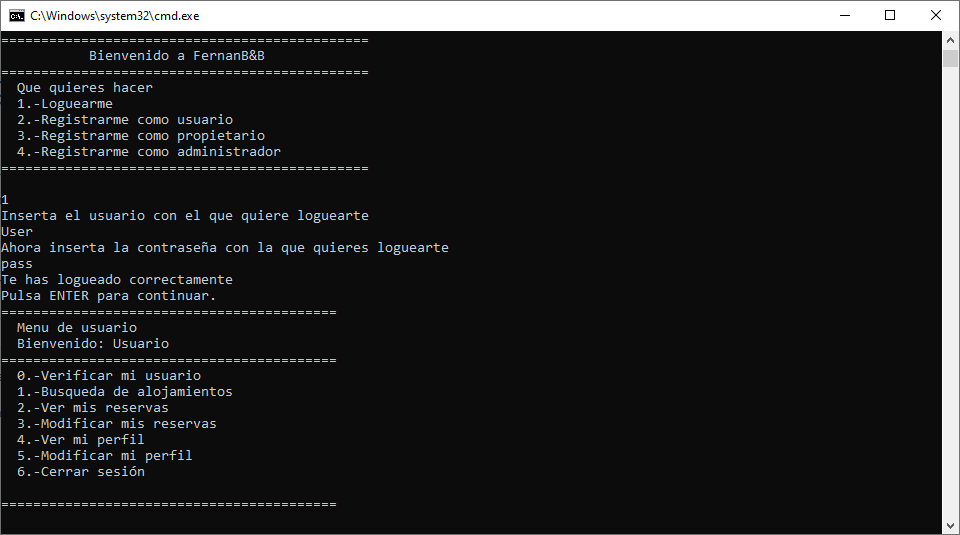

En este punto ya podemos usar las funcionalidades de los distintos usuarios, a partir de este punto yo utilizaré los datos que hemos insertado de base en el sistema, para explicar el funcionamiento de, los menús de los distintos usuarios.

#### Verificación de usuario

Se puede ver que en el menú de los usuarios, de base aparece la opción 0, esta opción sirve para verificar el usuario con el token que se ha enviado al correo, es un menú simple donde te pide que introduzcas el token y a partir de ese punto estarán disponibles todas las funcionalidades.

#### Vista y modificación de usuarios

Todos los usuarios tienen la posibilidad de ver y editar sus datos, este menú es común a todos ellos y simplemente hay que introducir los datos que se quieren modificar, hay que tener en cuenta que si se cambia el correo electrónico de un usuario hay que volver a verificarlo, para que este vuelva a tener acceso a todas las funcionalidades, se vuelve a mandar un correo.

### 2.-Menú de  Administrador

#### 1.-Vista de viviendas en alquiler

Muestra las viviendas en alquiler

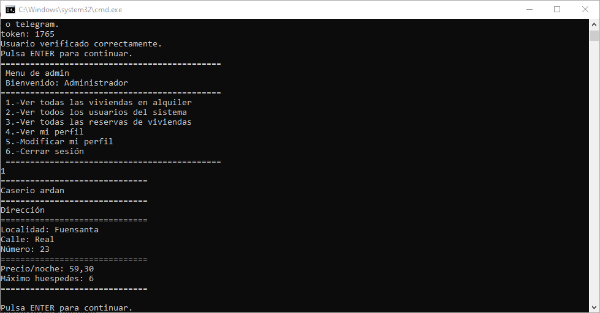

#### 2.-Vista de los usuarios del sistema

Muestra los usuarios del sistema

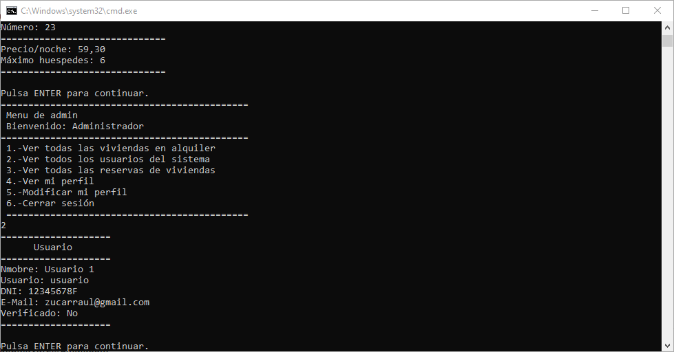

#### 3.-Vista de las reservas

Muestra todas las reservas de viviendas del sistema

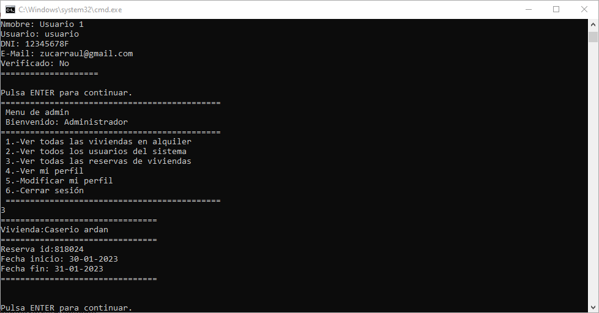

### 3.-Menú de Propietario

#### 1.-Vista de viviendas

Muestra la información de las viviendas del propietario

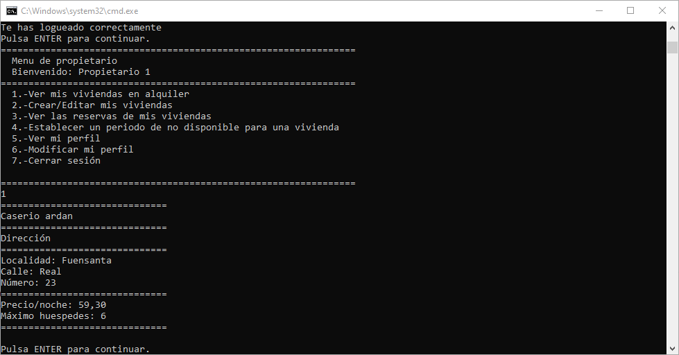

#### 2.Creacion/Edición de viviendas

En este menú se crean y se editan las viviendas.

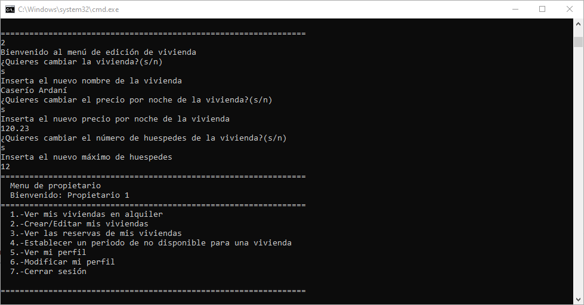

#### 3.-Vista de reservas

Muestra las reservas que corresponden a las viviendas del propietario

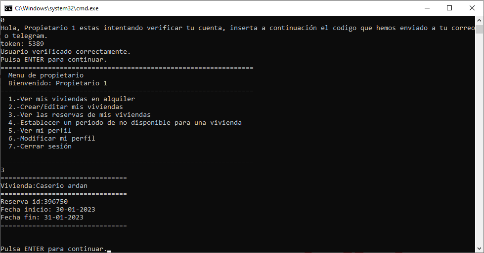

#### 4.-Establecer periodo de no disponibilidad 

Desde este menú el propietario puede bloquear la vivienda en una fecha, siempre que no hubiera una reserva previa durante esas fechas.

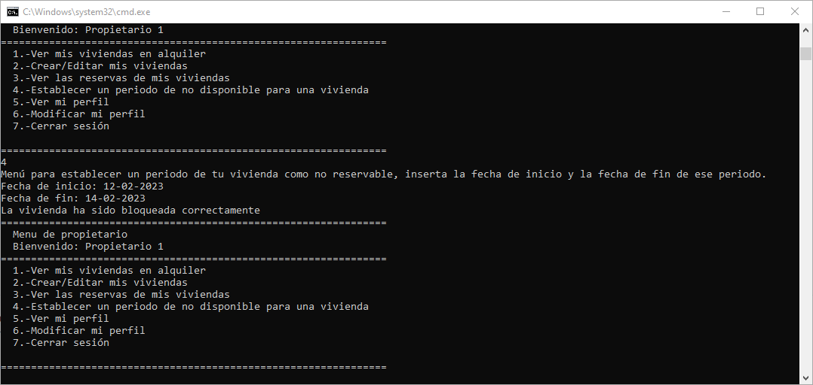

### 4.-Menú de Usuario

#### 1-Búsqueda de alojamientos

Desde este menú se realiza la búsqueda del alojamiento, primero se insertan las fechas y después la localidad en la que queremos buscar.

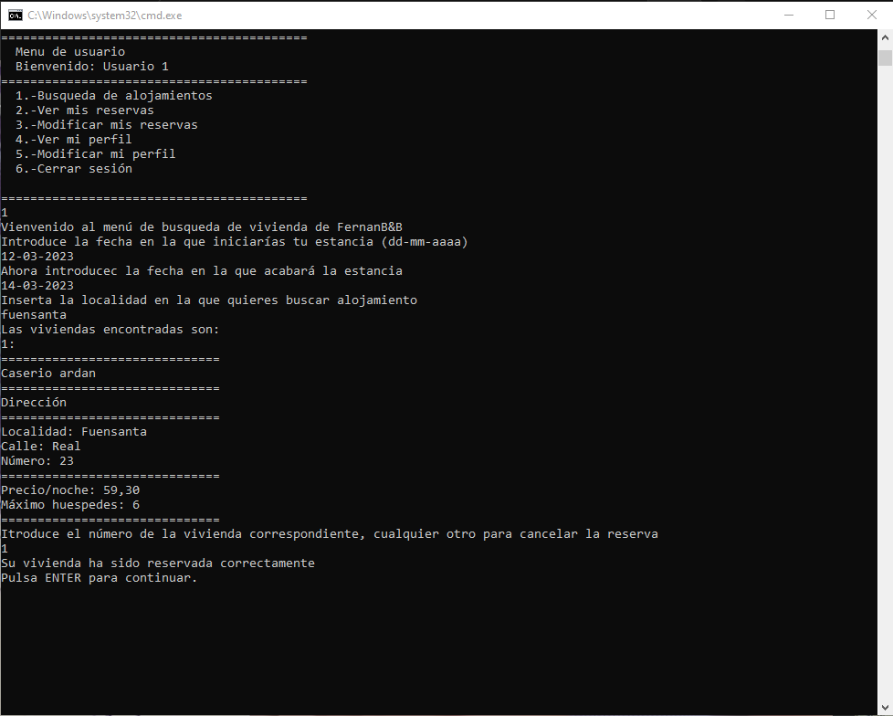

Después de realizar la reserva, se mandará una notificación al administrador, así como un correo al propietario de la vivienda y al usuario que realiza la reserva

#### 2.-Vista de reservas

Muestra las reservas del usuario

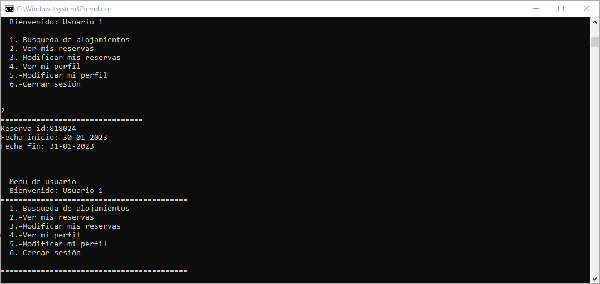

#### 3.-Modificación de reservas

Desde este menú se pueden modificar las reservas del usuario

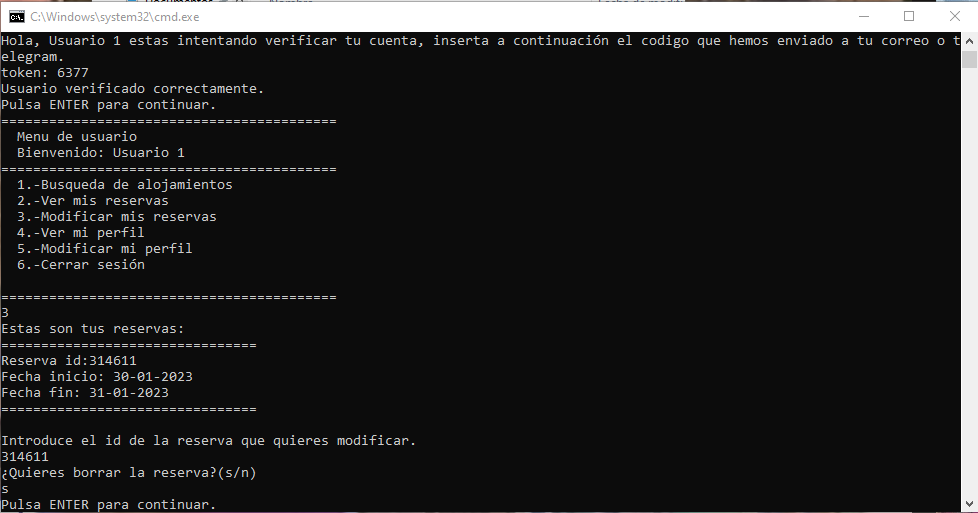

### 5.-UML

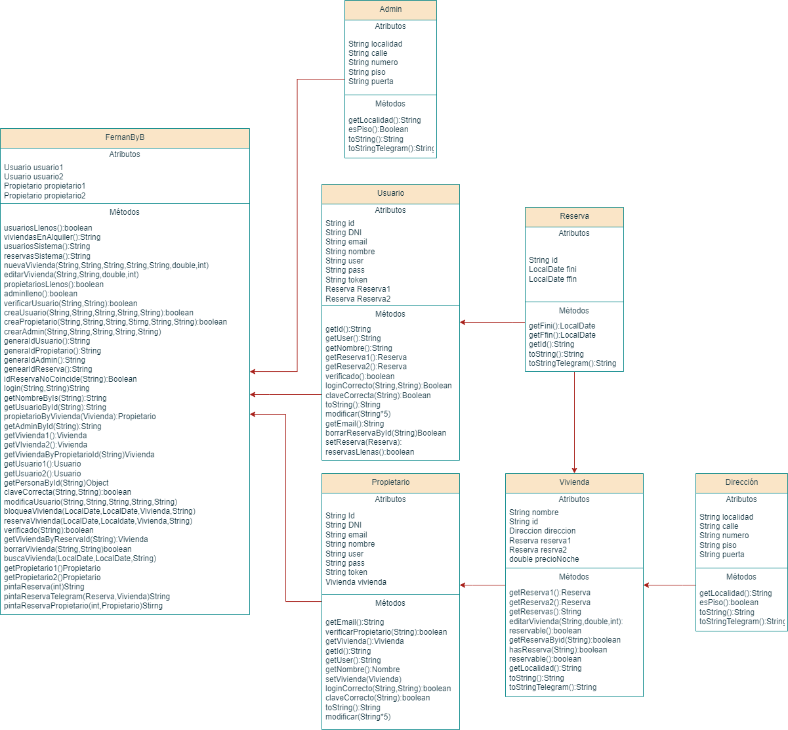